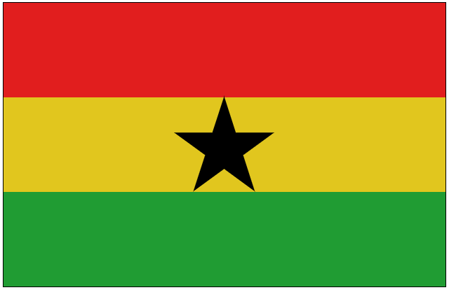

<h1 align="center">
    Original:  
    
</h1>

  <a href="#rocket-Technologies">Technologies</a>&nbsp;&nbsp;&nbsp;|&nbsp;&nbsp;&nbsp;
  <a href="#-project">Project</a>&nbsp;&nbsp;&nbsp;|&nbsp;&nbsp;&nbsp;
  <a href="#-layout">Layout</a>&nbsp;&nbsp;&nbsp;|&nbsp;&nbsp;&nbsp;
  <a href="#memo-license">License</a>

 

  

 

<h1 align="center">
  My project:  
  
</h1>

## 🚀 Technologies

This project was developed with the following technologies:

- [HTML5](https://en.wikipedia.org/wiki/HTML5)
- [CSS3](https://en.wikipedia.org/wiki/Cascading_Style_Sheets#CSS_3)

## 💻 Project

Ghana Flag, made with HTML and CSS, for practice.

## 🔖 Layout

You can view the project layout in the format via [this link](<https://codepen.io/leonardoj02/pen/ExaGZNp>).

## 🤔 How contribute

- Make a fork;
- Create a branch with your feature: `git checkout -b my-feature`;
- Do commit with your changes: `git commit -m 'feat: My new feature'`;
- Do a push for your branch: `git push origin my-feature`.

After the merge of your pull request was made, you can delete your branch.

## :memo: License

This project is under License MIT. See the documentation [LICENSE](LICENSE.md) for more details.

---

Developed by <a href="https://www.linkedin.com/in/leonardojesus02/">Leonardo Jesus</a>